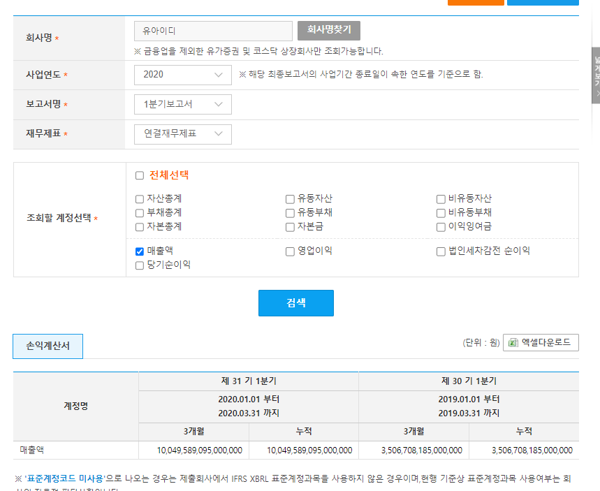
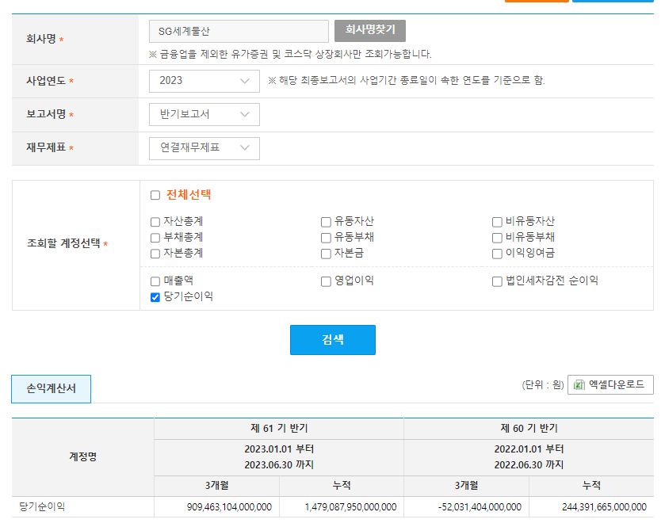

# DART 수집 이슈
## 1. 데이터 정확하지 않음 
수집 데이터 신뢰 할 수 없음 

예시 1

`유아이디(069330)` 2020년 1분기 보고서 전반적으로 숫자가 크게 다름 

예시 2 

`SG세계물산(004060)` 2023년 반기 보고서 전반적으로 숫자가 크게 다름 

[단일회사 전체 재무제표](https://opendart.fss.or.kr/guide/detail.do?apiGrpCd=DS003&apiId=2019020) 결과 값에 문제가 있음

API로 확인해도 되고, 쉽게 [DART 전자공시 Open API](https://opendart.fss.or.kr/disclosureinfo/fnltt/singlacnt/main.do)에서 확인 가능